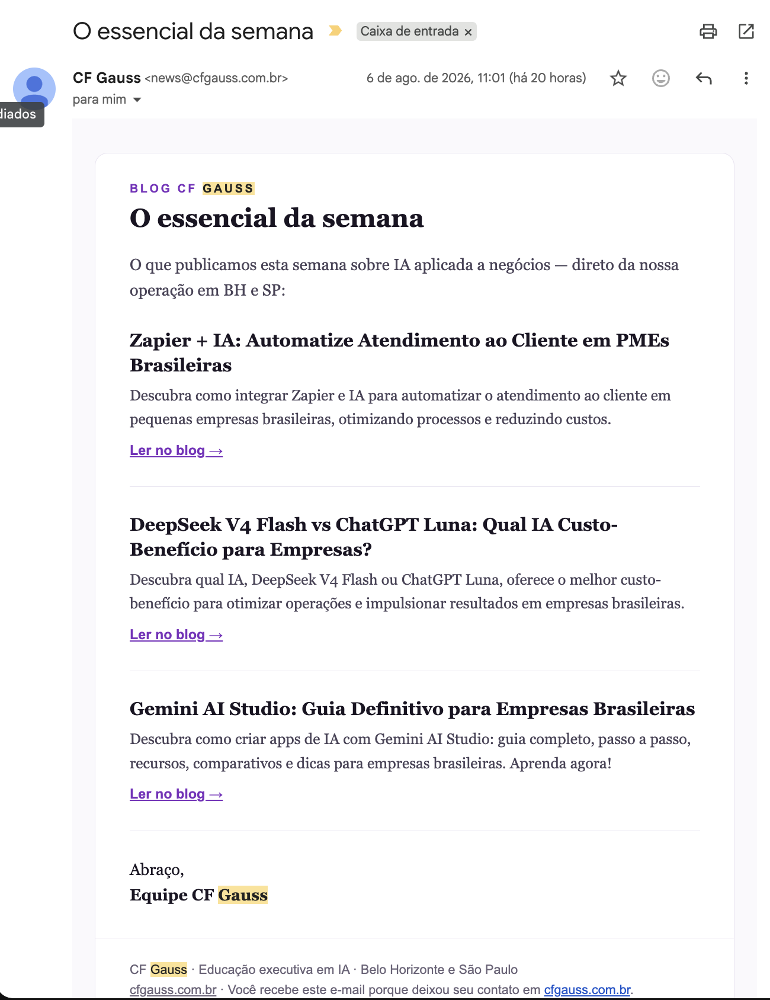
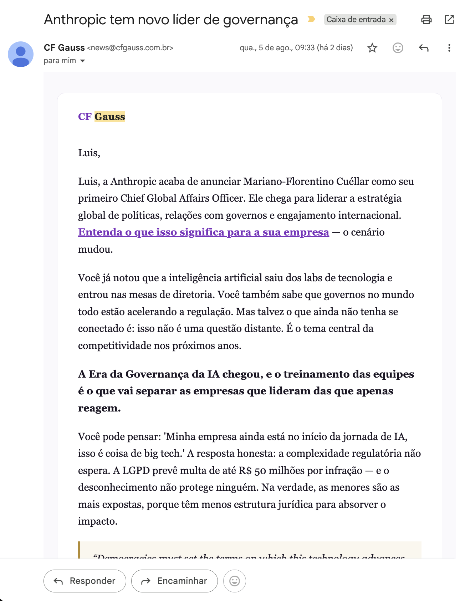
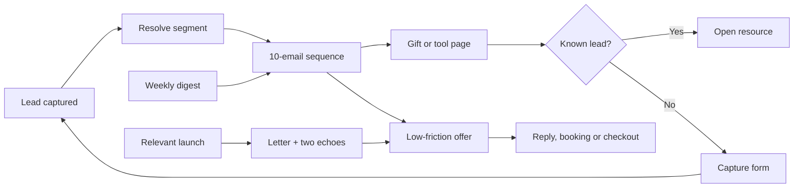

# My_MailMKT_makes_Neil_Proud

<p align="center">
  <strong>A portable direct-response email system for leads that should not go cold.</strong>
</p>

<p align="center">
  <a href="./LICENSE"></a>
  
  
  <a href="https://luisroquette.github.io/My_MailMKT_makes_Neil_Proud/"></a>
</p>


Most lead forms end in a spreadsheet, a CRM stage, or one forgettable welcome email.

My_MailMKT_makes_Neil_Proud gives the follow-up a structure. It turns a captured lead into a 25-day sequence of useful lessons, persuasive letters, fresh follow-up angles, gated resources and a low-friction offer. The system is designed to earn attention before asking for action.

This repository contains the portable skill, campaign templates, compliance guards, a working validator and the implementation guide used to adapt the method to a real product.

> **Independent project:** My_MailMKT_makes_Neil_Proud is not affiliated with, endorsed by, or sponsored by Neil Patel, NP Digital, or their companies. It uses established direct-response publishing patterns, never third-party copy, trademarks, or claims.

## What it produces

These are real inbox captures from a reference implementation for CF Gauss, shared with permission.

<table>
  <tr>
    <td width="33%" valign="top">
      <a href="assets/output-weekly-digest.png"></a>
      <p><strong>Weekly digest</strong><br>Useful editorial content keeps the relationship active between campaigns.</p>
    </td>
    <td width="33%" valign="top">
      <a href="assets/output-editorial-lesson.png"></a>
      <p><strong>Editorial lesson</strong><br>A practical lesson earns trust and leads naturally to a useful tool or resource.</p>
    </td>
    <td width="33%" valign="top">
      <a href="assets/output-campaign-letter.png"></a>
      <p><strong>Campaign letter</strong><br>One named thesis is argued with sourced facts, honest objections and one clear CTA.</p>
    </td>
  </tr>
</table>

<p align="center"><sub>Click any real inbox capture to open it at full size.</sub></p>

## The sequence

| Day | Format | Job |
|---:|---|---|
| D+0 | Lesson | Welcome the lead and teach something immediately useful. Tease the effect of the Big Idea. |
| D+1 | Letter | Reveal and name the Big Idea. Send the reader to a relevant resource. |
| D+3 | Lesson | Deepen the reader's understanding of the problem. |
| D+5 | Echo | Revisit the thesis through evidence or a sourced fact. |
| D+7 | Lesson | Give the reader a self-service tool, scorecard or checklist. |
| D+9 | Letter | Present the low-friction conversion offer. |
| D+12 | Echo | Answer the honest objection and name the cost of delay. |
| D+14 | Lesson | Teach the reader how to evaluate any provider, including you. |
| D+18 | Letter | Make the final truthful call for the current offer. |
| D+25 | Echo | Ask whether the topic is still relevant and open a human reply path. |

The system also supports a weekly digest and short launch campaigns. Each format has a different job, so the list does not receive ten variations of the same sales email.

## Closed-loop architecture



The key loop is simple: an email points to a resource; an existing subscriber gets it directly; an organic visitor leaves an email to receive it; that new lead enters the right sequence.

## Quick start

### 1. Clone and create a campaign workspace

```bash
git clone https://github.com/luisroquette/My_MailMKT_makes_Neil_Proud.git
cd My_MailMKT_makes_Neil_Proud
node scripts/init.mjs campaigns/my-offer
```

The command copies a safe starter set into `campaigns/my-offer` without overwriting an existing directory.

### 2. Fill the intake before writing copy

Complete these files in order:

1. `intake.md`: product, segments, offer, conversion channel and legal floor.
2. `fact-pack.json`: every number or external claim with its source and access date.
3. `compliance-rules.json`: prohibited claims and niche-specific boundaries.
4. `sequence.json`: the ten messages, CTAs, fact references and P.S. chain.

### 3. Validate the campaign

```bash
node scripts/validate.mjs campaigns/my-offer
```

The validator checks cadence, subject length, missing fields, duplicate steps, HTTPS CTAs, unknown fact IDs, unsupported numbers, banned claims and placeholders. It cannot replace legal review, inbox testing or consent management.

## Install as an agent skill

Install for Claude Code:

```bash
./scripts/install.sh claude
```

Install for Codex:

```bash
./scripts/install.sh codex
```

The installer copies only `SKILL.md` into the selected local skill directory. It never changes provider settings, credentials or global prompts.

Then ask your agent:

```text
Use My_MailMKT_makes_Neil_Proud to design a compliant 10-email sequence for this product.
Start with the intake. Do not write copy until the offer, segments, sources and legal floor are explicit.
```

## What is inside

```text
.
├── SKILL.md                         portable method for Claude Code and Codex
├── CHANGELOG.md                     version history
├── templates/                       campaign intake, fact pack and sequence scaffold
├── examples/b2b-ai-training/        complete validator-safe example
├── scripts/init.mjs                 creates a campaign workspace
├── scripts/validate.mjs             deterministic campaign checks
├── docs/ARCHITECTURE.md              data flow and storage contracts
├── docs/IMPLEMENTATION.md            Next.js, database and email-provider guide
└── assets/                           real outputs and project artwork
```

## What the method enforces

- **One named thesis per segment.** The Big Idea describes a real market tension, not a slogan about the product.
- **Three distinct formats.** Lessons teach, letters argue one thesis, and echoes return with a new angle.
- **One claim ledger.** Numbers must resolve to a fact ID with a source and access date.
- **Truthful pressure.** No fake scarcity, fabricated testimonials, guaranteed outcomes or invented counters.
- **A real opt-out path.** Consent, one-click unsubscribe, suppression and a monitored reply-to belong in the production implementation.
- **A tested subject-line angle, never a generic one.** Direct benefit, scarcity, social proof or curiosity — picked on purpose, personalized on the steps that earn it, checked against a spam-trigger word list.
- **One reformulated resend for the step that matters most**, only to non-openers, never a second argument.
- **A living segment, not a label.** A tagged click can move a lead mid-sequence without resetting the clock.
- **A fatigue gate.** A lead who stops opening gets skipped, not burned.

See [CHANGELOG.md](CHANGELOG.md) for the full version history.

## What this repository does not do

This is a portable system and campaign toolkit. It does not send email on its own, host a database, provide legal advice or include private production code from the reference implementations.

To run it in production, connect the contracts in [docs/IMPLEMENTATION.md](docs/IMPLEMENTATION.md) to your application, database and email provider. The reference architecture uses scheduled jobs, idempotent send logs, suppression lists and server-side tokens for gated resources.

## Verify the repository

```bash
npm test
```

The test command validates the complete example campaign with no external services and no API keys.

## License and use

MIT. See [LICENSE](LICENSE).

Use the structure, templates and validator in commercial or personal projects. Keep your claims sourced, respect consent, and adapt the compliance floor to the laws and professional rules that apply to your market.

## Contributing

Read [CONTRIBUTING.md](CONTRIBUTING.md) before opening a pull request. Security reports belong in the private channel described in [SECURITY.md](SECURITY.md).
