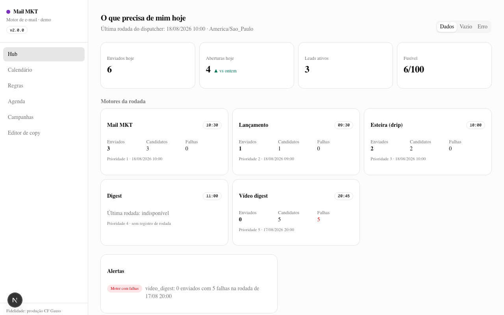
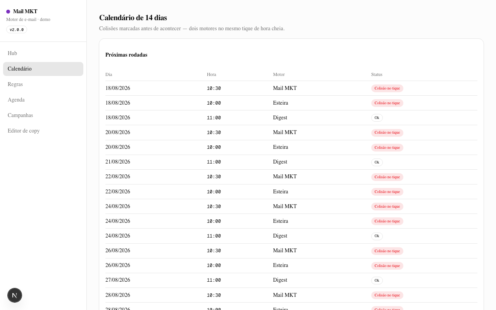
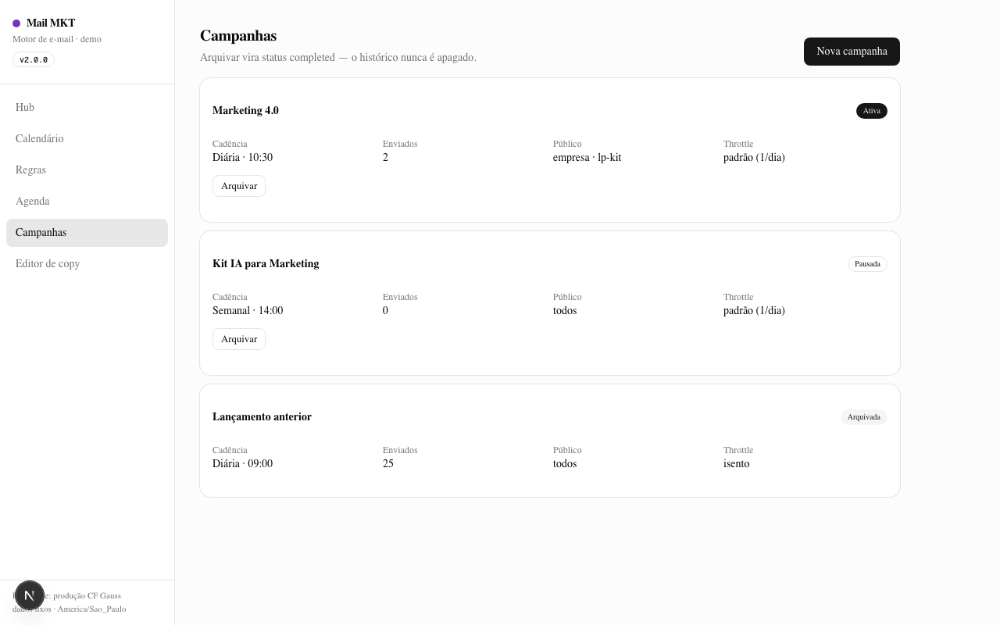
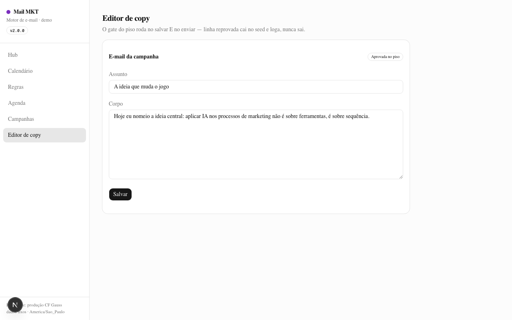

<p align="center">
  
</p>

<h1 align="center">My_MailMKT_makes_Neil_Proud</h1>

<p align="center">
  <strong>The email engine that follows up without becoming spam.</strong><br>
  A portable direct-response email system for Claude Code and Codex — the 25-day sequence, the shared throttle, the single dispatcher, the durable outbox, and the cockpit dashboard.
</p>

<p align="center">
  <a href="./LICENSE"></a>
  
  
  
  
  
</p>

> **Independent project:** My_MailMKT_makes_Neil_Proud is not affiliated with, endorsed by, or sponsored by Neil Patel, NP Digital, or their companies. It uses established direct-response publishing patterns, never third-party copy, trademarks, or claims.

---

## Table of contents

- [Em 30 segundos](#em-30-segundos)
- [O incidente que explica este repo](#o-incidente-que-explica-este-repo)
- [Para quem é este produto?](#para-quem-é-este-produto)
- [Instalação](#instalação)
- [Início rápido](#início-rápido)
- [Comandos](#comandos)
- [Características](#características)
- [A arquitetura do cockpit, em profundidade](#a-arquitetura-do-cockpit-em-profundidade)
- [O núcleo, porta por porta](#o-núcleo-porta-por-porta)
- [O runner do mail mkt, passo a passo](#o-runner-do-mail-mkt-passo-a-passo)
- [A dashboard demo, tela por tela](#a-dashboard-demo-tela-por-tela)
- [O contrato de fidelidade](#o-contrato-de-fidelidade)
- [A sequência de 25 dias, em profundidade](#a-sequência-de-25-dias-em-profundidade)
- [A dashboard e seus três estados](#a-dashboard-e-seus-três-estados)
- [Por que "porta/adaptador" — e não um port 1:1](#por-que-portaadaptador--e-não-um-port-11)
- [Roadmap do ecossistema](#roadmap-do-ecossistema)
- [As decisões que moldaram este repo](#as-decisões-que-moldaram-este-repo)
- [Em comparação com ferramentas manuais / de agência / comerciais](#em-comparação-com-ferramentas-manuais--de-agência--comerciais)
- [Casos de uso](#casos-de-uso)
- [Exemplo de saída](#exemplo-de-saída)
- [Arquitetura](#arquitetura)
- [Metodologia](#metodologia)
- [Novidades na versão 2.0.0](#novidades-na-versão-200)
- [Limitações](#limitações)
- [Requisitos](#requisitos)
- [Desinstalar](#desinstalar)
- [Extensões](#extensões)
- [Ecossistema](#ecossistema)
- [Documentação](#documentação)
- [Perguntas frequentes](#perguntas-frequentes)
- [Colaboradores da comunidade](#colaboradores-da-comunidade)
- [Licença](#licença)
- [Contribuindo](#contribuindo)
- [Lições do port, achado por achado](#lições-do-port-achado-por-achado)
- [A última palavra](#a-última-palavra)
- [Autor](#autor)

---

## Em 30 segundos

A lead enters from a landing page. The dispatcher — one cron, once an hour — asks the agenda who is due, runs the motors in priority order, and every motor passes through **one shared throttle**: one email per lead per day, twenty hours between sends. The copy is checked by a deterministic floor on save and on send. The email goes out through a durable outbox — reserved, claimed, sent, completed — and an ambiguous result fails closed instead of double-sending. Every CTA ships as a tracking link. A dashboard shows the last round per motor, the 14-day collision calendar, the rules, the campaigns and the copy editor. And a lead who unsubscribes is never written to again — not by any of the five motors.

That is the entire product: content that earns attention, control that prevents spam, operations that show you the state. The rest of this README is the terrain. If the thirty-second version already sounds like what you needed, jump to [Início rápido](#início-rápido) — the test suite runs in seconds and tells you whether the machine is honest.

---

## O incidente que explica este repo

On a morning in August 2026, a real lead received three emails in one hour: a launch campaign at 09:30, a drip step at 10:01, a marketing email at 10:30. The system had five independent runners, five independent cron jobs, and five independent throttle states. Each runner asked one question — "is this email due for this lead?" — and none of them asked the question that mattered: "did any other runner already write to this lead today?"

The fix became this repository's core: **one shared throttle, one dispatcher, one cron.** The five motors still exist — mail marketing, launch, drip, digest, video digest — but they no longer decide independently. They pass through a single throttle state loaded once per round, shared in memory, so the second motor sees what the first just served. The old routes were deleted, not just removed from the schedule — because as long as they existed, anything with the cron secret could send outside the throttle. A regression test fails the build if any of them ever returns.

This incident is not backstory; it is the architecture. Every "why" in the README below traces back to it.

---

## Para quem é este produto?

This skill exists for people who have learned that follow-up is a trust exercise, not a volume exercise. If you run nurture flows, launch campaigns or marketing sequences — and the line between "useful follow-up" and "spam" is your reputation — this is for you.

**In-house teams running nurture and campaigns.** You send lessons, letters, digests and offers on a calendar. The throttle, the blackout windows and the fuse are editable by screen, never by deploy — because "the schedule changed" should not mean "ship a code change".

**Agencies running email for clients.** Every client gets the same engine, the same guarantees, the same dashboard. The deliverable stops being "a tool" and becomes "a system the client can audit" — the dashboard is the report, live.

**Developers building marketing automation.** The nucleus is TypeScript with zero runtime dependencies and a port/adaptor design: repositories, senders, queues and clocks are contracts. Wire Supabase and Resend for production, or the in-memory adaptors for a demo that runs with nothing external.

If you send one campaign a quarter, a spreadsheet is fine. This skill earns its weight when email is a recurring product of your operation — and when sending one email too many costs more than sending one too few.

---

## Instalação

### Option A — Claude Code skill (recommended)

```bash
git clone https://github.com/luisroquette/My_MailMKT_makes_Neil_Proud.git ~/.claude/skills/my-mailmkt-makes-neil-proud
```

Restart Claude Code — the skill loads as `my-mailmkt-makes-neil-proud`. The nucleus has zero runtime dependencies; the validators are deterministic.

### Option B — manual download

```bash
# read before running, as always
curl -L https://github.com/luisroquette/My_MailMKT_makes_Neil_Proud/archive/refs/heads/main.tar.gz | tar xz
mv My_MailMKT_makes_Neil_Proud-main my-mailmkt-makes-neil-proud
```

### Option C — Codex

`agents/openai.yaml` loads the same skill under Codex.

**Requirements:** Node 20+ for the TypeScript nucleus (vitest for the test suite); Python 3.10+ for the campaign validator; the dashboard demo needs Node 20+ and npm.

---

## Início rápido

```bash
# 1. Install and run the deterministic suite — 107 tests, zero external services
npm install
npm test

# 2. Validate the canonical campaign
npm run validate -- examples/b2b-ai-training

# 3. Run the cockpit demo
cd dashboard && npm install && npm run dev
# open http://localhost:3000
```

The test suite is the contract in executable form: throttle sharing between motors, hour-truncated agenda matching, outbox fail-closed behavior, suppression enforcement, XSS escaping with real injection, deterministic config merging. If the suite fails, the engine is broken — fix that before anything else.

---

## Comandos

The skill is an operating cycle, not a bag of utilities. Five stages, each deterministic.

| Stage | What it does | Contract |
|---|---|---|
| 1. **Intake** | Leads enter from an LP — name, WhatsApp, email, source, page, UTMs — normalized defensively | `integracoes/src/lp/` |
| 2. **Briefing** | Product, segments, offer, resource, conversion channel, fact pack, legal floor — if unknown, ask; never invent | `SKILL.md` |
| 3. **Copy + validation** | The 25-day sequence plus campaign copy, gated by the deterministic floor on save AND send | `nucleo/src/piso.ts` |
| 4. **Send** | One dispatcher, priority order, shared throttle, durable outbox | `nucleo/src/dispatcher.ts` |
| 5. **Health** | The cockpit dashboard — last round per motor, collisions, rules, campaigns, copy | `dashboard/` |

Validators:

```bash
npm test                                              # 107 deterministic tests
npm run validate -- examples/b2b-ai-training          # campaign contract + copy floor
```

One rule crosses all five stages: **the lead's inbox is not a volume target.** Every mechanism below — throttle, fuse, blackout, floor, opt-out — exists to keep the engine on the useful side of that line.

---

## Características

**One throttle, five motors.** One email per lead per day, twenty hours minimum between sends, one state shared across mail marketing, launch, drip, digest and video digest in the same round. The second motor sees what the first served. The incident in the README's opening is the regression test that guards this.

**One cron, one dispatcher.** A single hourly tick asks the database-backed agenda who is due, then runs the due motors in priority order — `mail_mkt > lancamento > esteira > digest > video_digest` — with one shared fuse and a 240-second loop budget inside the platform's 300-second limit.

**Rules in the database, editable by screen.** Cadence, hours, allowed days, blackout windows, the fuse, audiences and copy all live in a singleton config row merged over defaults. An invalid value falls back to the default, field by field — the engine never fails open, and changing the schedule never means a deploy.

**A durable outbox.** Reserve → claim (5-minute lease) → send → complete. Definitive failures release for tomorrow's retry; ambiguous results (timeouts, 5xx) fail closed — the reservation is preserved and the email is never resent in the same round. Rows stuck past 23 hours become dead-letters with an alert and a terminal state.

**The 25-day sequence as data.** Ten messages — lessons, letters and echoes — D+0 to D+25, each format with a different job, so the list never reads as ten variations of the same sales email.

**Real campaign cadence.** Per campaign: `send_hour`, `interval_days`, `weekdays`, `audience_filter` (segments, sources, minimum lead age), `throttle_exempt` — the fields the production system edits by screen, ported exactly.

**Every CTA tracked.** Each marketing link ships as a `mailmkt-<slug>` tracking link under the sibling tracklink contract, with UTMs and click events; body links get per-destination slugs. Analytics never blocks delivery — a failed tracking write degrades to the raw URL and logs.

**LGPD by construction.** List-Unsubscribe (mailto + HTTPS) and one-click unsubscribe on every message, no exceptions; opt-outs checked by the runner and by the outbox resume path; suppression reads are paginated so the 1001st opt-out is honored like the first.

**A cockpit dashboard demo.** Six screens — hub, 14-day collision calendar, rules, agenda, campaigns, copy editor — on deterministic fixtures, with the three data states (loading/empty/error) and every query contract documented next to its mock.

---

## A arquitetura do cockpit, em profundidade

### The nucleus — ports and adaptors

`nucleo/` is channel-agnostic TypeScript with zero runtime dependencies. Everything external is a port — `RepositorioDeNurture`, `FilaOutbox`, `EnviadorDeEmail`, `Relogio`, `RegistradorDeEventos` — and the adaptors implement them. Production wires Supabase (paginated reads, the four atomic outbox RPCs, unique-violation dedupe) and Resend (single outbound path, mandatory List-Unsubscribe, error mapping). The demo wires the in-memory adaptors and runs with nothing external. The engine does not know which it is talking to.

### The throttle — the heart

The state loads once per round, after orphan reservations are cleaned — inverting that order makes an abandoned reservation block a legitimate lead across every motor. The window is `max(24h, minHorasEntreEnvios)`, the local day is computed in `America/Sao_Paulo` through `Intl` — never `Date#getHours()`, because the runtime is UTC and the schedule is not. `aplicarEnvio` mutates the shared state so the second motor sees what the first just served.

### The agenda — hour-truncated on purpose

The dispatcher ticks at the top of the hour and compares by hour-only, truncated deliberately: defaults like 09:30, 10:30 and 20:45 must be reachable by a `:00` tick. A replica that compares exact HH:MM — or ticks at a different minute — silently breaks every default schedule. The `:00` tick at 10:00 fires both mail marketing (10:30) and the drip (10:00); the dispatcher resolves the collision by priority.

### The outbox — fail closed

An email's journey: durable log reservation (unique per email+type — the dedupe that makes double-sends structurally impossible), outbox reserve, claim with lease, send, complete. A definitive 4xx releases the row for tomorrow; a timeout or 5xx preserves it — because a duplicate is worse than a gap, and the resume path retries only after the 20-hour minimum. Dead-letters alert and enter a terminal state; orphan rows older than an hour and never attempted are hard-deleted before the throttle loads.

### The five motors

- **mail_mkt** — the fully ported motor: real cadence, the 25-day sequence, per-campaign audience filters, one tracking link per occurrence.
- **lancamento** — campaign letters with a deterministic gate on save and on send.
- **esteira** — the drip that follows the D+0..D+25 sequence for every lead.
- **digest** — the weekly editorial digest, one link per article.
- **video_digest** — the video digest at 20:45.

The other four ship as contracts and specs; mail_mkt is the complete reference implementation, and the porting checklist for the next motor is documented.

---

## O núcleo, porta por porta

The nucleus is TypeScript with zero runtime dependencies. Every external system is a port — an interface the engine depends on, implemented by adaptors the engine never imports. Reading the ports is reading the architecture.

**`RepositorioDeNurture`** — the data side. `lerLeads` is paginated (the reference PostgREST truncates raw selects at 1000 rows silently — a capped read here means leads beyond the cap silently stop receiving email, so pagination is mandatory, not an optimization). `lerSupressoes` returns the opt-out set and is paginated the same way. `lerLogDeEnvio` reads the send log for the throttle window. `reservarNoLog` inserts the durable reservation and reports `"ok" | "duplicado" | "erro"` — the unique violation is the dedupe that makes a double-send structurally impossible.

**`FilaOutbox`** — the durability side. `reservar` (new reservation, `false` when the key exists — the return value is honored, because discarding it would resend duplicates), `reivindicar` (claim an existing pending row with a lease), `concluir`, `liberar`, `listarPendentes` (for resume and dead-letter), `removerOrfas` (hard-delete never-attempted rows older than an hour), `descartar` (terminal dead-letter state).

**`EnviadorDeEmail`** — the outbound side. One method, `enviar`, returning `"entregue" | "falhaDefinitiva" | "ambiguo"`. The Resend adaptor maps 4xx (except 429) to definitive, 429/5xx/timeouts to ambiguous, and adds List-Unsubscribe + one-click headers to every message — the header extraction handles "Nome <email>" senders, because a broken mailto header is a compliance failure, not a cosmetic one.

**`Relogio`** — the wall clock. `agoraIso()`, `horaLocalHH()` (hour-only, truncated on purpose) and `diaDaSemanaLocal()` — all in `America/Sao_Paulo`. The engine never calls `Date#getHours()`, because the runtime is UTC and the schedule is not.

**`RegistradorDeEventos`** — opens, clicks, conversions. Best-effort by contract: analytics never blocks delivery. The Supabase adaptor writes `nurture_email_events`; the demo records in memory.

The in-memory adaptors implement the same ports with deterministic fixtures and a fixed clock — the test suite and the dashboard demo run on them with nothing external. Swapping adaptors is the entire migration story.

---

## O runner do mail mkt, passo a passo

The complete journey of one campaign occurrence, in the exact order the code executes:

1. **Who is due?** The dispatcher asks the agenda at the top of the hour; the marketing runner filters its campaigns by status, weekday, send hour (hour-truncated) and date bounds — `startDate` in the future means scheduled, `endDate` in the past means done.

2. **Which leads?** All leads load once per round — never per campaign, or ten campaigns would scan the table ten times. The audience filter applies: segments in, sources in, minimum lead age, with unparseable creation dates excluded when a minimum is set.

3. **The copy gate.** The floor runs on the campaign copy before anything is reserved. A rejected line logs its findings and the campaign is skipped — the same deterministic gate the editor runs on save.

4. **Preview, for real.** In dry mode, the runner counts candidates and stops — no tracking writes, no reservations, no sends. A preview that side-effects is not a preview.

5. **One tracking link per occurrence.** The CTA resolves to a `mailmkt-<slug>` tracking link once per occurrence — never per lead, which would be redundant inserts. Body links get per-destination slugs (hash plus destination prefix), so two different article links never collapse into one.

6. **Per lead:** suppress first (opt-outs are checked before anything is reserved), throttle second (unless the campaign is exempt), fuse third (`esgotado` before the reservation, `consumir` only after it succeeds — a duplicate must not burn a token).

7. **Reserve, then send.** The durable log reservation happens before the outbox; a unique violation means the email was already sent and the lead is skipped with `reserva_conflito`. Then the outbox runs reserve → send → complete, and `aplicarEnvio` mutates the shared throttle so the next motor in the round sees this send.

8. **Count only reality.** `enviados` counts real deliveries, never attempts — an attempted candidate the sender rejects does not inflate the number, and the "zero sends with failures" alert fires on the truth.

---

## A dashboard demo, tela por tela



**Hub — "o que precisa de mim hoje".** KPIs (sent today, opens, active leads, fuse), one block per motor with its last round — a read that fails renders as unavailable, never as zero — and the alert panel with the three alert classes: motor with zero sends plus failures, campaign with zero sends, outbox dead-letter.



**Calendário — 14 dias.** The scheduled hours with collisions marked before they happen: mail marketing at 10:30 and the drip at 10:00 collide on the hour-truncated tick, exactly as the dispatcher will resolve them.



**Campanhas.** Active, paused and archived campaigns with cadence, send hour, audience and throttle status. Archiving is a status change — the history is never deleted.



**Regras, Agenda e Copy.** The rules screen edits the singleton config with the same validation the engine merges; the agenda toggles allowed days; the copy editor runs the deterministic floor on every keystroke and refuses to save a rejected line — the same gate the sender runs before shipping.

Every screen's production query is documented in `dashboard/data/contratos.ts` — the demo shows the mock next to the exact SQL it replaces.

---

## O contrato de fidelidade

This repository is a port of a production system. The fidelity contract states, rule by rule, what the port must preserve:

| Rule | Where it lives |
|---|---|
| 1 email/lead/day + 20h minimum, shared across all motors in one round | `nucleo/src/throttle.ts` |
| ONE cron; priority `mail_mkt > lancamento > esteira > digest > video_digest` | `nucleo/src/dispatcher.ts` |
| Hour-only comparison, truncated on purpose | `nucleo/src/agenda.ts` |
| Rules in the database, merged over defaults; invalid falls back, never throws | `nucleo/src/config.ts` |
| Durable outbox; ambiguous = fail closed, never resend in the round | `nucleo/src/outbox.ts` |
| Timezone `America/Sao_Paulo` always; never `getHours()` | `nucleo/src/throttle.ts` |
| Every CTA is a `mailmkt-<slug>` tracking link; analytics never blocks delivery | `integracoes/src/tracklink/` |
| List-Unsubscribe + one-click on EVERY message | `adapters/src/resend/` |
| Archive = status change, never delete | `dashboard/app/campanhas/` |
| Idempotency key carries the occurrence id, never `next_send_on` | `motores/src/mail-mkt/runner.ts` |
| Dry mode is a pure preview — no sends, no tracking writes, no cleanup | `nucleo/src/dispatcher.ts` |
| Copy floor runs on save AND on send | `nucleo/src/piso.ts` + runner |

Each rule has a regression test. A port that changes any of them is a fork, not a port.

---

## A sequência de 25 dias, em profundidade

The sequence is the content layer inherited from v1.1.1 — ten messages across twenty-five days, three formats with three different jobs:

| Dia | Formato | Função |
|---:|---|---|
| D+0 | lesson | Welcome and teach something immediately useful. Tease the effect of the Big Idea. |
| D+1 | letter | Reveal and name the Big Idea. Send the reader to a relevant resource. |
| D+3 | lesson | Deepen the reader's understanding of the problem. |
| D+5 | echo | Revisit the thesis through evidence or a sourced fact. |
| D+7 | lesson | Give the reader a self-service tool, scorecard or checklist. |
| D+9 | letter | Present the low-friction conversion offer. |
| D+12 | echo | Answer the honest objection and name the cost of delay. |
| D+14 | lesson | Teach the reader how to evaluate any provider — including you. |
| D+18 | letter | Make the final truthful call for the current offer. |
| D+25 | echo | Ask whether the topic is still relevant and open a human reply path. |

Three formats exist so the list never reads as ten variations of the same sales email. A lesson earns attention; a letter argues; an echo revisits. The mix is the methodology — and the methodology is preserved as data (`motores/src/mail-mkt/sequencia.ts`), so changing the days, formats or copy is a data change, not a fork.

The copy discipline inherited from v1.1.1 is still the law: subjects fall into four angles (direct benefit, real scarcity, social proof, curiosity), personalization uses `{{lead.firstName}}` on the welcome and the re-engagement steps, CTAs state the outcome and never the mechanism, and every number traces to a fact-pack entry. The deterministic floor enforces what the methodology demands.

---

## A dashboard e seus três estados

The cockpit demo demonstrates the three data states as first-class citizens — because a dashboard that cannot show "we do not know" will show "zero" instead, and a zero that is really a failure sends the operator looking at the wrong thing.

**Carregando** — skeletons on the KPI tiles, the motor blocks and the alert panel. The alert panel shows skeletons, never "no alerts", for data that has not arrived: the false "all quiet" is the most expensive loading state in operations.

**Vazio** — the hub renders "Nenhuma rodada registrada ainda" with the next tick time, and the campaigns screen renders "Nenhuma campanha ainda — crie a primeira". Empty states carry the next action.

**Erro** — the hub renders the error card with the contract's own rule printed on it: "Leitura que falha é null — a dashboard degrada, o envio não". The retry button is there because the operator's next action is retry.

The state selector (Dados/Vazio/Erro) exists in the demo on purpose: it is the demonstration of degradation, not debug clutter — every screen documents its production query next to the mock, and the swap from fixtures to queries is the integration work, not a redesign.

---

## Por que "porta/adaptador" — e não um port 1:1

A 1:1 port would have copied the production code with Supabase and Resend hardcoded — faithful, but only runnable against one stack, and the demo would depend on a real database. The port/adaptor design costs a layer of indirection and buys three things:

1. **The demo and the tests run with nothing external.** The in-memory adaptors implement the same ports with deterministic fixtures and a fixed clock — the 107 tests and the dashboard demo are self-contained, forever.
2. **The guarantees are testable in isolation.** The throttle, the outbox and the gates are pure functions over ports — the suite exercises them without a network, and a regression in any guarantee fails in seconds.
3. **Migration is swapping adaptors.** Moving the engine to another database, another sender or another clock is an adaptor, not a rewrite — the nucleus never imports a vendor.

The fidelity contract still binds: the Supabase adaptor preserves the pagination, the unique-violation dedupe and the four atomic RPCs; the Resend adaptor preserves the mandatory headers and the error mapping. Fidelity lives in the adaptors; portability lives in the ports.

---

## Roadmap do ecossistema

**Now — consolidation.** The three sibling skills are published and interoperating: the LP produces leads, the email engine nurtures them under the throttle, the tracking layer attributes every CTA.

**Next — the four sibling motors.** mail_mkt is the complete reference implementation; the porting checklist for lancamento, esteira, digest and video_digest is documented, and each new motor follows it the way the reference engine's 16-point checklist prevented silent breakage.

**Then — the unified dashboard.** The cockpit demo's documented queries and the tracking skill's metrics contract meet in one screen: sends per motor, clicks per campaign, leads by source — one place for the whole funnel.

**Later — the knowledge graph.** When the motors, rules and contracts grow, the repository becomes a graph corpus, so "which rule touches which motor" is a query, not a memory.

---

## As decisões que moldaram este repo

The cockpit was extracted from production through owner decisions. They explain *why* the repo looks the way it does:

1. **The complete cockpit, not a partial one.** The most complete option won: five motors, the dashboard, the plugs.
2. **End-to-end tracking.** Every CTA ships as a tracked link with events; the LP feeds leads in through the intake contract.
3. **A runnable demo + documented contracts.** The dashboard runs on fixtures; every query documents its production SQL.
4. **The tracklink structure, mirrored.** `nucleo/` + `motores/` + `integracoes/` + `adapters/` + `dashboard/`.
5. **One version, v2.0.0.** Tag + GitHub Release in a single merge.
6. **The graph before the port.** The CF Gauss knowledge graph was rebuilt with the nurture corpus first, so the coupling hotspots were known before the code moved.
7. **Port/adaptor over 1:1 Supabase coupling.** The nucleus is stack-free; the faithful adaptors are separate.

---

## Em comparação com ferramentas manuais / de agência / comerciais

| | Sequência à mão | Agência | Plataforma de e-mail | **My_MailMKT_makes_Neil_Proud** |
|---|---|---|---|---|
| Throttle global entre motores | ✗ | Manual | Interno, parcial | **Sim — compartilhado e testado** |
| Regras editáveis sem deploy | ✗ | ✗ | Parcial | **Sim — singleton + fallback** |
| Outbox durável com fail-closed | ✗ | ✗ | Interno, invisível | **Sim — contrato aberto** |
| Auditável por você | ✗ | Só o relatório | ✗ | **Sim — 107 testes + contratos** |
| Funciona sem vendor | Sim | — | ✗ | **Sim — zero deps no núcleo** |
| Dashboard do estado real | ✗ | ✗ | Sim, fechado | **Sim — demo + SQL documentado** |
| Copy com gate determinístico | ✗ | Depende do redator | ✗ | **Sim — piso no salvar E no enviar** |
| Portável entre clientes | ✗ | ✗ | Licenças | **MIT — clone por cliente** |

Use a hand-run sequence while the list is small and the risk is yours. Use an agency when you are buying copy judgment. Use a platform when you need its deliverability infrastructure. Use My_MailMKT when you need the *guarantees* — the throttle, the outbox, the gates — as auditable code instead of vendor promises.

---

## Casos de uso

### 1. The workshop funnel

A workshop LP captures leads; the drip teaches for 25 days; the mail marketing campaign promotes the next workshop. Three motors, one throttle — a lead attending the workshop still receives at most one email per day, no matter how many campaigns are active.

### 2. The launch

A coming-soon page collects leads; the launch motor sends the campaign letters on the schedule; the digest keeps the relationship warm between launches. The fuse caps the round, the blackout respects the audience's night, and the dashboard shows the collisions before they happen.

### 3. The agency running email for multiple clients

Each client gets the engine, the dashboard demo and the contracts. The client can run the test suite and read the fidelity contract — the deliverable is a system they own, not a service they rent.

---

## Exemplo de saída

Real output, unedited:

```
$ npm test
 Test Files  15 passed (15)
      Tests  107 passed (107)

$ npm run validate -- examples/b2b-ai-training
Campaign validation passed: examples/b2b-ai-training

$ npm run validate -- /tmp/campaign-broken
Campaign validation failed with 4 error(s):
- campaign.json: status inválido "sei-la" (active|paused|completed)
- campaign.json: cadence inválida "mensal" (hourly|daily|weekly)
- campaign.json: offerUrl deve começar com https://
- campaign.json: copy contém termo banido "garantido"
```

Every error names the field and the rule. Fix the campaign, not the validator.

---

## Arquitetura

```
nucleo/        channel-agnostic engine — throttle, dispatcher, outbox, config, agenda, floor
motores/       the five motors; mail-mkt fully ported (cadence, sequence, runner)
integracoes/   tracklink (every CTA tracked) + lp (lead intake)
adapters/      supabase (faithful) · resend (faithful) · memoria (demo on fixtures)
dashboard/     standalone demo — hub, calendar, rules, agenda, campaigns, copy editor
scripts/       validate.mjs — deterministic campaign validator
docs/          implementation guide, product site, single-entry route reference
```

Three principles hold the architecture together:

**The nucleus is stack-free.** Ports define the contracts; adaptors implement them. The engine does not import Supabase or Resend — production adaptors do, and the demo adaptors do not.

**One cron in production.** The single-entry route reference (`docs/ROTA-DE-REFERENCIA.md`) is explicit: one route calls `rodarDispatcher`, never one route per motor — recreating five routes recreates the incident.

**Every guarantee has a test.** The 107 tests are the fidelity contract in executable form. A change that breaks a rule breaks a test; a change that adds a rule adds a test in the same commit.

---

## Metodologia

The cockpit was ported from a production system that earned its rules through real incidents, and the port earned its guarantees through two whole-branch review rounds that found — and fixed — three criticals and eleven importants before release.

**Review finds what per-task checks miss.** Round one found the opt-out that no motor checked, the outbox without a claim path, and a dry mode that sent real email. Round two found the dry mode still touching the resume path, body links collapsing into one slug, and the resume path ignoring opt-outs. Each fix landed with a regression test in the same commit; the loop stopped at two consecutive clean rounds.

**Determinism over cleverness.** The validators and the floor are plain functions with no LLM calls — same input, same verdict, forever. The copy floor bans a fixed list of sensationalist terms; a line that fails it falls back to the seed and logs, it never ships.

**Absence is never zero.** A failed dashboard read renders as unavailable; a missing metric is missing, not zero; a campaign with no sends is an alert, not a silent row.

**The incident is the architecture.** The shared throttle, the single dispatcher and the deleted old routes are not design preferences — they are the fix to a real morning when a real lead received three emails in an hour. The regression test that guards them fails the build if any of the old routes returns.

---

## Novidades na versão 2.0.0

- **`nucleo/`** — the shared throttle, the dispatcher with priority and fuse, the durable outbox (claim/lease, 23h dead-letter), config with fallback, the hour-truncated agenda, the copy floor.
- **`motores/mail-mkt/`** — real cadence (send_hour, interval_days, weekdays, audience_filter, throttle_exempt), the 25-day sequence, the end-to-end runner.
- **`integracoes/`** — the tracklink plug (every CTA tracked, body links per-destination) and the LP intake contract.
- **`adapters/`** — faithful Supabase (paginated, dedupe, RPCs) and Resend (mandatory List-Unsubscribe, error mapping), plus the in-memory adaptors.
- **`dashboard/`** — the six-screen cockpit demo with documented production queries.
- **107 tests, two review rounds, one release.**

Changelog: [CHANGELOG.md](./CHANGELOG.md) · Releases: [GitHub Releases](https://github.com/luisroquette/My_MailMKT_makes_Neil_Proud/releases)

---

## Limitações

- **The four sibling motors ship as contracts, not implementations.** mail_mkt is the complete reference; the porting checklist for the next motor is documented.
- **The demo dashboard is fixtures, not production.** Its queries are documented for the swap; the swap itself is your integration work.
- **Deliverability is the platform's job.** The engine guarantees the sending discipline; the ESP guarantees inbox placement. The two are different guarantees.
- **The 25-day sequence is a starting shape.** Days, formats and copy are data — change them through the contracts, not by forking the runner.

If a limitation blocks you, that is a design conversation — the contracts are explicit precisely so that conversation happens before the campaign does.

---

## Requisitos

- Node 20+ (nucleus + test suite)
- Python 3.10+ (campaign validator)
- Claude Code or Codex
- No API keys, no database, no network for the core cycle and the demo

---

## Desinstalar

```bash
rm -rf ~/.claude/skills/my-mailmkt-makes-neil-proud
```

Nothing is installed outside the skill directory.

---

## Extensões

- **My_UTMs_Make_Me_Proud** — the tracking layer this repo references for every CTA.
- **My_LP_Makes_Neil_Proud** — the LP engine whose leads the intake contract consumes.
- **Dashboard contract** — the cockpit demo documents the production SQL per screen.

---

## Ecossistema

| Skill | Layer | Relationship |
|---|---|---|
| My_UTMs_Make_Me_Proud | Tracking | Owns the contract — every MailMKT CTA references it |
| My_LP_Makes_Neil_Proud | Landing pages | Produces the leads the intake consumes |
| **My_MailMKT_makes_Neil_Proud** (this repo) | Email nurture | The follow-up that must not become spam |

Capture → nurture → attribution, one contract.

---

## Documentação

- [SKILL.md](./SKILL.md) — the cycle and the fidelity contract
- [nucleo/](./nucleo/) — the engine, port by port
- [dashboard/data/contratos.ts](./dashboard/data/contratos.ts) — production queries per screen
- [docs/](./docs/) — implementation guide, product site, single-entry route reference
- [docs/README-v1.1.1.md](./docs/README-v1.1.1.md) — the v1.x content-layer methodology, preserved

---

## Perguntas frequentes

**Is it free?** Yes. MIT.

**Does it send email by itself?** No — the engine defines the discipline and the adaptors wire the sending. Production uses Resend through the faithful adaptor; the demo uses in-memory fixtures.

**Why one email per day?** Because the incident that created this repo proved that five independent schedules produce three emails in an hour. The throttle is the guarantee that the mistake cannot repeat — across any number of motors.

**Why "rules in the database"?** Because "the schedule changed" must never mean "ship a code change". The singleton config merges over defaults, invalid values fall back, and the screens edit it.

**What does fail-closed mean for the outbox?** A timeout or 5xx is ambiguous: the email may have been sent. The reservation is preserved and the email is never resent in the same round — a duplicate is worse than a gap. The resume path retries only after the 20-hour minimum.

**How do I know the dashboard reflects reality?** Each screen's production SQL is documented next to its mock in `dashboard/data/contratos.ts`. The demo shows the shape; the contract shows the query.

**Can the engine run without Supabase?** Yes — the nucleus is stack-free. The in-memory adaptors run the demo and the tests; production adaptors are separate and swappable.

**What is the success bar for this repo?** The name says it: the email marketing makes Neil proud — useful, sequenced, and disciplined. Concretely: no lead ever receives more than one email a day from this system, every CTA is tracked, every opt-out is honored, and the dashboard shows the state in one screen. If any of those fails, the test suite fails.

**How do the blackout windows work?** The config holds `{inicio, fim}` pairs in HH:MM. The dispatcher checks the hour-truncated tick against every window before anything runs — ranges may cross midnight ("22:00" → "06:00"), and a window shorter than one hour is flagged with a warning, because the hour-truncated comparison cannot honor sub-hour windows.

**Why is the priority order fixed in the config?** Because the reference system's order was a business decision — mail marketing before launch before drip before digest before video digest — and business decisions live in the database, merged over defaults. The dispatcher follows the config's order, never a hardcoded constant, so changing the priority is a screen edit, not a deploy.

**What happens when two motors collide on the same tick?** The hour-truncated agenda marks both as due, the dispatcher runs them in priority order, and the shared throttle means the first motor's sends count against the second. The 14-day calendar marks the collision before it happens — the operator sees Tuesday's overlap on Monday.

---

## Colaboradores da comunidade

The contributor table is open. The contribution that matters here: a bug class found in a guarantee and pinned as a regression test in the same commit.

---

## Licença

MIT — see [LICENSE](./LICENSE).

---

## Contribuindo

**Every guarantee fix lands with its regression test in the same commit.** Run `npm test` before opening a PR. Contracts change through discussion in the issue first, code second.

---

## Lições do port, achado por achado

Two whole-branch review rounds ran before the v2.0.0 release. The findings are public because they are the difference between a port and a promise. The criticals, with their fixes:

**Opt-outs were never checked by the runner.** The suppression table existed, the schema promised "checked by every motor", and the grep showed zero call sites. A lead who clicked one-click unsubscribe would keep receiving email on the next occurrence. Fix: suppression checks before any reservation, plus a regression test with a suppressed lead in the seed.

**The outbox had no claim path.** The contract promised reserve → claim → complete, and the schema shipped three of four functions. A process dying between reserve and complete would leave the row in flight forever. Fix: the claim RPC with lease, the resume path with the 20-hour minimum, dead-letters with a terminal state, and the orphan cleanup that runs before the throttle loads.

**Dry mode sent real email.** The preview flag was accepted and ignored — an operator running `?dry=1` to inspect a round would dispatch real sends. Fix: dry is a pure preview — no sends, no tracking writes, no orphan cleanup, no resume — and the regression test asserts zero side effects.

And the importants that shaped the details: body links collapsing into one slug (fixed with per-destination slugs — hash plus prefix, because a 32-bit hash alone collides), the resume path ignoring opt-outs, the fuse burning tokens on duplicate reservations, the database priority silently switching off unlisted motors (the list is an order, never an inclusion filter), and an XSS test that passed without the escape — replaced with a real injection that fails the suite if `escapeHtml` is removed.

Each finding is a regression test now. The suite can only grow.

---

## A última palavra

Email marketing fails in two ways: too little — leads go cold — and too much — leads unsubscribe. The v1.x content layer solved the first with the 25-day sequence; the v2.0.0 cockpit solves the second with the throttle, the dispatcher and the outbox, and the dashboard makes both visible in one screen. Together they are the engine's actual product: follow-up that earns attention without spending trust.

That is the standard the name sets. An email system that makes Neil proud is not the one that sends the most — it is the one where every send is deliberate, every lead is respected, every CTA is tracked, and the operator can see the whole state in one screen. If a lead ever receives two emails in a day from this engine, the test suite fails. That is not a slogan; it is the suite — and the suite is the guarantee you can run, on your machine, in your CI, forever, on every future change, without asking anyone's permission.

---

## Autor

**Luis Roquette** — Anthropic Select Services Partner, building the CF Gauss marketing stack (LP engine → email engine → tracking) as portable, auditable open-source skills.

<p align="center">
  <a href="https://github.com/luisroquette/My_UTMs_Make_Me_Proud">My_UTMs_Make_Me_Proud</a> ·
  <a href="https://github.com/luisroquette/My_LP_Makes_Neil_Proud">My_LP_Makes_Neil_Proud</a> ·
  <a href="https://github.com/luisroquette/My_MailMKT_makes_Neil_Proud">My_MailMKT_makes_Neil_Proud</a>
</p>
