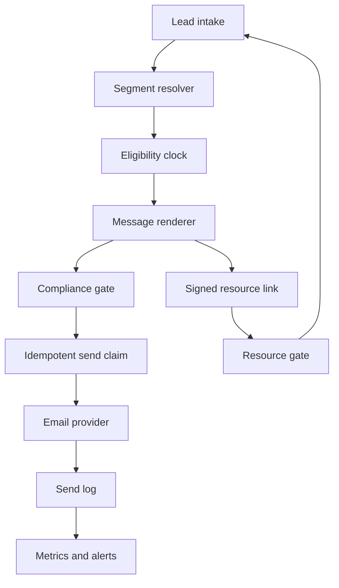

# Architecture

Motor Empiricus separates writing decisions from delivery infrastructure. This keeps the method portable and lets each implementation choose its own framework, database and email provider.

## Components



## Contracts

### Lead

```ts
type Lead = {
  id: string;
  email: string;
  name?: string;
  source: string;
  segment: string;
  createdAt: string;
  consentAt: string;
  suppressedAt?: string;
};
```

### Message

```ts
type Message = {
  id: string;
  day: number;
  format: "lesson" | "letter" | "echo";
  subject: string;
  preheader: string;
  body: string;
  ctaLabel: string;
  ctaUrl: string;
  postscript?: string;
  factIds: string[];
};
```

### Send claim

Use a unique key on `(recipient_email, message_id, campaign_id)`. Claim the send before calling the provider. A second worker that races for the same recipient should lose the insert and skip the send.

If the provider returns a success ID, store it. If the provider fails before accepting the message, release only that claim so the scheduled job can retry. Never clear a claim after an ambiguous provider response without checking provider and application logs first.

## Eligibility

The clock is anchored to the lead's enrollment time, not the job execution time. At each run:

1. Load eligible, non-suppressed leads.
2. Calculate which message is due.
3. Select the oldest due message that has not been claimed.
4. Validate and render it.
5. Send at most one sequence message per lead per run.

This avoids a burst of overdue messages after downtime or migration.

## Resource gate

A link from an email can include the recipient identifier and an HMAC signed server-side. The resource route verifies the signature before returning protected content.

An unknown visitor sees a capture form. After a successful server-side lead insert, the application issues a new signed URL. Do not render protected content into hidden client components, serialized props or the initial page payload.

## Failure visibility

Treat a run with zero successful sends and one or more attempted failures as a failed run. Return a failing status or emit a separate alert. A scheduled endpoint that always returns success hides the only failure that matters.
