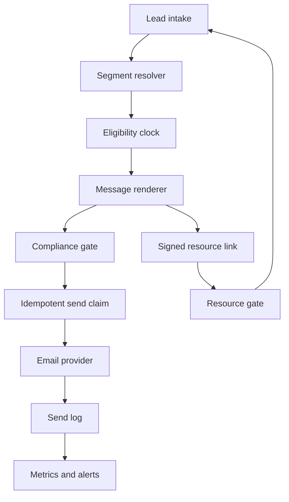

# Architecture

Motor Empiricus separates writing decisions from delivery infrastructure. This keeps the method portable and lets each implementation choose its own framework, database and email provider.

## Components



## Contracts

### Lead

```ts
type Lead = {
  id: string;
  email: string;
  name?: string;
  source: string;
  segment: string;
  createdAt: string;
  consentAt: string;
  suppressedAt?: string;
};
```

`segment` is mutable after capture — see "Re-segmentation from clicks" below for when and how it may change mid-sequence.

### Click

```ts
type Click = {
  leadId: string;
  campaignId: string;
  messageId: string;
  url: string;
  segmentTag?: string;
  clickedAt: string;
};
```

`segmentTag` is set only when the CTA itself was built to signal a segment (for example, a resource link scoped to one product line). Do not infer a segment from a click that carries no tag — a click alone is engagement, not evidence.

### Message

```ts
type Message = {
  id: string;
  day: number;
  format: "lesson" | "letter" | "echo";
  subject: string;
  preheader: string;
  body: string;
  ctaLabel: string;
  ctaUrl: string;
  postscript?: string;
  factIds: string[];
};
```

`subject` and `body` may contain the merge token `{{lead.firstName}}`. Render it server-side from the lead record before sending; never leave the literal token in a delivered message. If the lead has no name on file, fall back to a neutral opening rather than sending an empty or malformed greeting.

### Send claim

Use a unique key on `(recipient_email, message_id, campaign_id)`. Claim the send before calling the provider. A second worker that races for the same recipient should lose the insert and skip the send.

If the provider returns a success ID, store it. If the provider fails before accepting the message, release only that claim so the scheduled job can retry. Never clear a claim after an ambiguous provider response without checking provider and application logs first.

## Resend to non-openers

A resend is a second send of one underperforming step, with only the subject reformulated, to leads who did not open the original within a fixed window. It uses its own `message_id` — the existing send-claim unique key `(recipient_email, message_id, campaign_id)` already isolates it from the original send, no schema change required.

Eligibility, checked in the same daily run:

1. Requires open-tracking from your provider (pixel or webhook). If your provider does not report opens, do not implement resends — do not approximate "opened" from a click or a guess.
2. The original message was sent at least `afterDays` ago and has no recorded open.
3. No resend has already been claimed for this `(lead, resendOf)` pair — cap one resend per original step, ever. Never resend a resend.
4. Body, CTA and postscript are inherited from the original step unchanged. Only the subject differs — a resend is not a new argument, it is the same message getting a second chance at the inbox.

## Eligibility

The clock is anchored to the lead's enrollment time, not the job execution time. At each run:

1. Load eligible, non-suppressed leads.
2. Calculate which message is due.
3. Select the oldest due message that has not been claimed.
4. Check the fatigue gate (below); skip this lead for this run if it trips.
5. Validate and render it.
6. Send at most one sequence message per lead per run.

This avoids a burst of overdue messages after downtime or migration.

## Fatigue gate

A fixed cadence has no defense against burning a list on its own. Before claiming a send, check the lead's rolling open rate over its last sent messages (a small fixed window, for example the last 3). If every one of them went unopened, skip this run's send for that lead and log the skip — do not cancel the lead from the sequence, just let the next scheduled run re-evaluate.

- Never apply the gate to `echo` steps whose job is explicitly re-engagement (the day-25 message exists to reach an unresponsive lead — gating it defeats its purpose).
- A skip is not a failure. Do not raise the same alert used for provider failures; log it as its own event so a real outage is never confused with normal fatigue management.
- This is a per-lead check, not a campaign-wide kill switch — one disengaged lead should never pause sends to the rest of the segment.

## Resource gate

A link from an email can include the recipient identifier and an HMAC signed server-side. The resource route verifies the signature before returning protected content.

An unknown visitor sees a capture form. After a successful server-side lead insert, the application issues a new signed URL. Do not render protected content into hidden client components, serialized props or the initial page payload.

## Re-segmentation from clicks

The segment resolved at capture is the default for the entire sequence. Update it mid-sequence only on a tagged click (see `Click.segmentTag`) — never from time-on-page, scroll depth, or any other soft signal.

1. A tagged click updates `Lead.segment` and records the previous value, the new value and the triggering click for audit.
2. Re-segmentation never resets the eligibility clock. The clock stays anchored to the original `enrollmentTime` — otherwise a lead who clicks twice restarts the sequence twice and never reaches the offer.
3. Messages already sent under the old segment are not retracted or reinterpreted. Only messages not yet sent render under the new segment's Big Idea and fact pack.
4. If the new segment has no configured sequence, keep the lead on the original segment's sequence rather than dropping them from the clock.

## Failure visibility

Treat a run with zero successful sends and one or more attempted failures as a failed run. Return a failing status or emit a separate alert. A scheduled endpoint that always returns success hides the only failure that matters.
